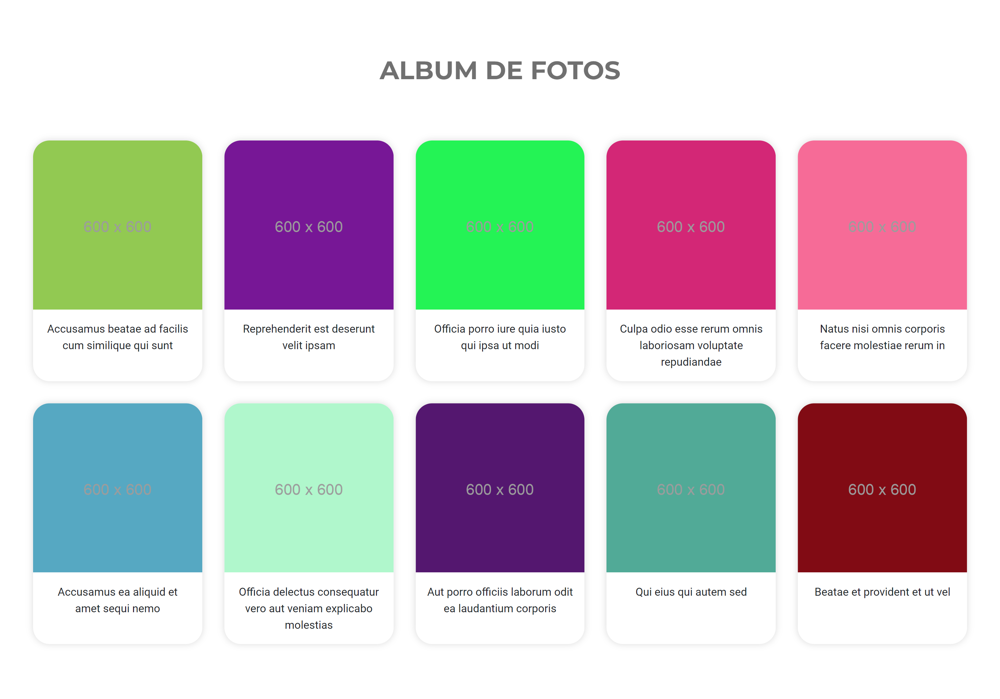
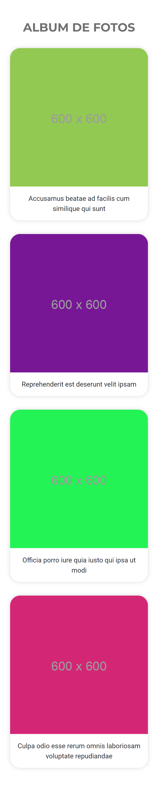

# Desafío Promesas

En este desafío se validarán los conocimientos de Introducción a la asincronía, Callbacks, Promesas y async/await en JavaScript.

## Capturas

## Tecnologías usadas

- Javascript
- CSS
- HTML
- Bootstrap

## Requerimientos

1. Implementar ES6 para toda la estructura del código. 
 
2. Crear una función asíncrona para obtener los datos de la URL (https://jsonplaceholder.typicode.com/photos). 
 
3. Dentro de un bloque Try/Catch, utilizar el método fetch mediante la instrucción await para recibir el valor directamente de la promesa.  
 
4. Utilizar  un  método  de  iteración  de  arreglos  (por  ejemplo:  forEach)  para  mostrar solamente los primeros 20 títulos de los datos recibidos. 
 
5. Crear una función que retorne una promesa después de tres (3) segundos utilizando setTimeout.  El  mensaje  a  retornar debe  ser  un  string  que  indique:  “Información Enviada”.  
 
6. Crear una función asíncrona que permita recibir el mensaje de la promesa creada en el requerimiento cinco (5), de forma directa con await, para ser mostrado en la consola del navegador, agregando el llamado a las dos funciones principales.
